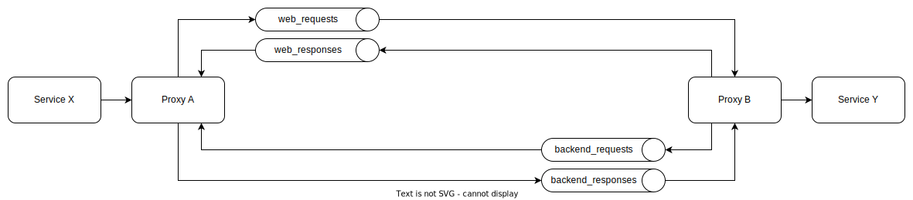

# GXF Soap bridge

This component can be used to bridge gaps between environments.
The GXF platform doesn't have to reside on a single location/namespace/network zone.
To make this bridge seamless it acts like a proxy. It will accept your SOAP call, send it over Kafka to the other end
and re-issue the SOAP request over there.

# Kafka communication - Example

- `Servce X` will try to call Service Y. You've configured X to make the request to the proxy instead
- `Proxy A` will
    - store the HTTP connection used to receive the request and keep it open
    - receive the SOAP body and some meta data
    - make a message object of it
    - sign this message
    - and send it over the `web_requests` Kafka topic
- `Proxy B` will
    - receive the message from the Kafka topic `web_requests`
    - check the signature
    - unwrap the message
    - use the SOAP body to do the SOAP request to `Service Y` and receive a SOAP result body
    - make a message object of that result body
    - sign this message
    - and send it over the `web_responses` Kafka topic
- `Proxy A` will then
    - receive the message from the Kafka topic `web_responses`
    - check the signature
    - unwrap the message
    - find the stored HTTP connection that was used to initiate this request
    - write the SOAP result body to the HTTP response
- `Service X` will receive a SOAP response not even knowing it talked to a proxy

## Notifications ("The other way around")

You can also configure this to work the other way around; `Service Y` calling `Service X`.
In GXF terms, this is called a notification.
Each proxy instance can act as both proxy start and end point as seen in the image above.
